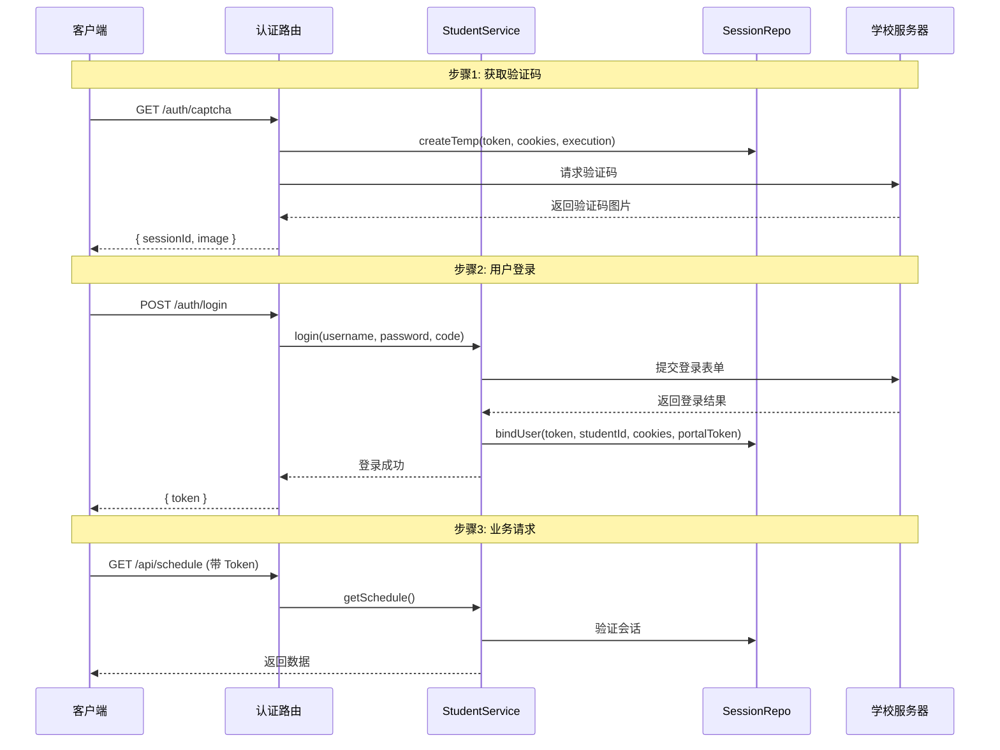
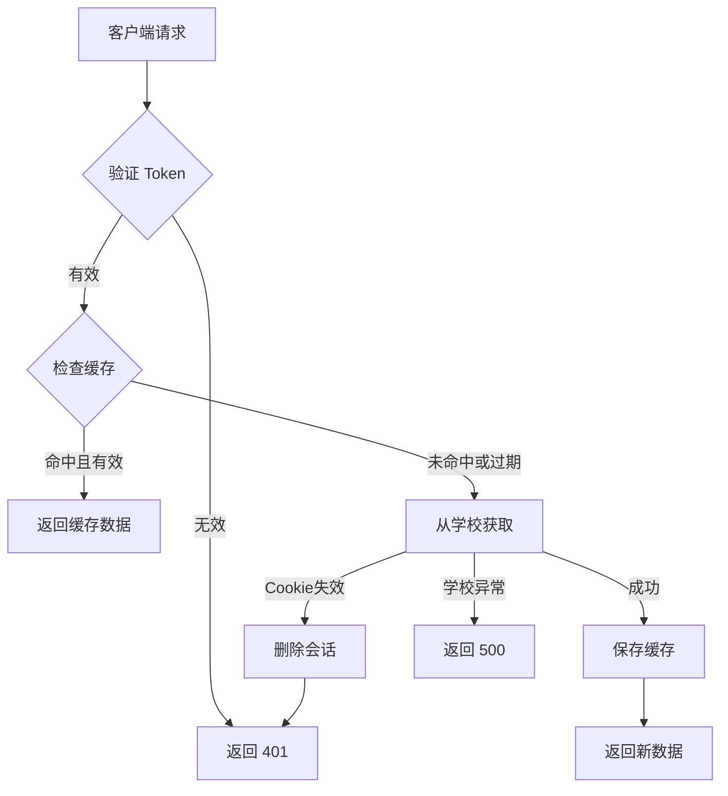

# 系统架构设计文档

## 1. 项目概览

### 1.1 项目简介
本项目是一个高校教务系统对接中间件服务，为小程序提供统一的后端 API。通过代理学校教务系统（CAS + 正方/强智），解决了原系统存在的 Session 有效期短、并发限制、网络不稳定等问题。

### 1.2 核心特性
- ✅ **持久化登录**: Token 与学校 Session 解绑，支持长期登录
- ✅ **缓存优先**: 采用 SWR 策略，减少学校服务器压力
- ✅ **多端支持**: 同一用户可在多设备登录，数据互通
- ✅ **智能刷新**: 差异化缓存策略，符合实际使用场景
- ✅ **安全防护**: 速率限制、SQL 注入防御、XSS 防护

### 1.3 技术栈
| 类别 | 技术 | 版本 |
|------|------|------|
| 运行时 | Bun | 最新 |
| Web 框架 | Hono | 最新 |
| 语言 | TypeScript | 5.x+ |
| 数据库 | SQLite | 3.x |
| HTML 解析 | Cheerio | 最新 |
| Cookie 管理 | tough-cookie | 最新 |

---

## 2. 系统架构

### 2.1 分层架构

```
┌─────────────────────────────────────────────────┐
│              客户端（小程序/H5）                  │
└─────────────────────────────────────────────────┘
                       ▲
                       │ HTTP/HTTPS
                       ▼
┌─────────────────────────────────────────────────┐
│                 路由层 (Routes)                  │
│  ┌─────────┬──────────┬──────────┬────────────┐ │
│  │ Auth    │ API      │ System   │ Static     │ │
│  │ Routes  │ Routes   │ Routes   │ Files      │ │
│  └─────────┴──────────┴──────────┴────────────┘ │
└─────────────────────────────────────────────────┘
                       ▲
                       │
                       ▼
┌─────────────────────────────────────────────────┐
│              中间件层 (Middleware)               │
│  ┌──────────────────────────────────────────┐   │
│  │ CORS │ 性能监控 │ 日志 │ 速率限制        │   │
│  └──────────────────────────────────────────┘   │
└─────────────────────────────────────────────────┘
                       ▲
                       │
                       ▼
┌─────────────────────────────────────────────────┐
│               业务服务层 (Services)              │
│  ┌──────────────────────────────────────────┐   │
│  │  StudentService (继承 BaseService)       │   │
│  │  - login()  - getSchedule()              │   │
│  │  - getECard()  - getUserInfo()           │   │
│  └──────────────────────────────────────────┘   │
└─────────────────────────────────────────────────┘
                       ▲
                       │
            ┌──────────┴───────────┐
            ▼                      ▼
┌─────────────────────┐  ┌─────────────────────┐
│  核心层 (Core)      │  │  数据层 (Database)  │
│  ┌───────────────┐  │  │  ┌───────────────┐  │
│  │ HuasClient    │  │  │  │ SessionRepo   │  │
│  │ NetworkSession│  │  │  │ CacheRepo     │  │
│  │ Parser        │  │  │  │ UserRepo      │  │
│  │ Security      │  │  │  │ StatsRepo     │  │
│  └───────────────┘  │  │  └───────────────┘  │
└─────────────────────┘  └─────────────────────┘
                                 ▼
                       ┌──────────────────┐
                       │  SQLite Database │
                       │  (WAL 模式)      │
                       └──────────────────┘
            ▲
            │ HTTP 请求
            ▼
┌─────────────────────────────────────────────────┐
│            学校教务系统 (External)               │
│      CAS 认证 + 正方/强智教务系统                │
└─────────────────────────────────────────────────┘
```

### 2.2 目录结构

```
src/
├── core/                      # 核心层
│   ├── api/                   # 外部 API 封装
│   │   ├── AuthApi.ts         # 认证 API
│   │   ├── JwApi.ts           # 教务 API
│   │   ├── PortalApi.ts       # 门户 API
│   │   └── UserApi.ts         # 用户 API
│   ├── handlers/              # 处理器
│   │   └── RouteHandler.ts    # 路由处理器基类
│   ├── middleware/            # 中间件
│   │   └── MiddlewareFactory.ts # 中间件工厂
│   ├── network/               # 网络层
│   │   └── NetworkSession.ts  # 网络会话管理
│   ├── utils/                 # 工具类
│   │   ├── CryptoHelper.ts    # 加密工具
│   │   ├── Logger.ts          # 日志工具
│   │   ├── LogRotator.ts      # 日志轮转
│   │   ├── PerformanceMonitor.ts # 性能监控
│   │   ├── ProcessManager.ts  # 进程管理
│   │   └── errors.ts          # 错误定义
│   ├── HuasClient.ts          # 教务系统客户端
│   ├── Scheduler.ts           # 定时任务调度器
│   └── security.ts            # 安全工具
├── db/                        # 数据层
│   ├── CacheRepo.ts           # 缓存仓库
│   ├── SessionRepo.ts         # 会话仓库
│   ├── UserRepo.ts            # 用户仓库
│   ├── StatsRepo.ts           # 统计仓库
│   └── index.ts               # 数据库初始化
├── parsers/                   # 解析器层
│   ├── ECardParser.ts         # 一卡通解析器
│   ├── ScheduleParser.ts      # 课表解析器
│   └── UserParser.ts          # 用户信息解析器
├── routes/                    # 路由层
│   ├── api.routes.ts          # 业务 API 路由
│   ├── auth.routes.ts         # 认证路由
│   └── system.routes.ts       # 系统路由
├── services/                  # 服务层
│   ├── BaseService.ts         # 基础服务抽象类
│   └── StudentService.ts      # 学生服务
├── test/                      # 测试
│   ├── e2e/                   # 端到端测试
│   ├── helpers/               # 测试辅助
│   ├── integration/           # 集成测试
│   ├── performance/           # 性能测试
│   ├── security/              # 安全测试
│   └── unit/                  # 单元测试
├── config.ts                  # 配置管理
├── server.ts                  # 服务器入口
└── types.ts                   # 类型定义
```

---

## 3. 核心模块设计

### 3.1 认证流程



### 3.2 数据获取流程（SWR 策略）



### 3.3 会话管理

#### 会话生命周期
```
临时会话 (验证码阶段)
    ↓ 登录成功
活跃会话 (已绑定学号)
    ↓ 90天未活跃 或 主动退出
已删除
```

#### 会话清理策略
| 类型 | 条件 | 清理时间 | 执行频率 |
|------|------|---------|---------|
| 僵尸会话 | 未登录且超过 10 分钟 | 立即 | 每小时 |
| 不活跃会话 | 90 天未活跃 | 立即 | 每小时 |

### 3.4 缓存策略

```typescript
// 课表缓存：动态 TTL
const isExpired = (updatedAt: number) => {
    const thisMonday = getThisMonday(); // 本周一 00:00
    return updatedAt < thisMonday;
};

// 用户信息缓存：固定 30 天
const TTL = 30 * 24 * 60 * 60 * 1000;

// 一卡通：无缓存（总是实时）
const TTL = 0;
```

---

## 4. 数据库设计

### 4.1 ER 图

```
┌─────────────────┐         ┌──────────────────┐
│     users       │         │    sessions      │
├─────────────────┤         ├──────────────────┤
│ student_id (PK) │←────────│ token (PK)       │
│ name            │    1:N  │ student_id (FK)  │
│ class_name      │         │ cookies          │
│ last_active_at  │         │ portal_token     │
└─────────────────┘         │ execution        │
        │                   │ user_agent       │
        │                   │ created_at       │
        │                   │ updated_at       │
        │                   └──────────────────┘
        │ 1:N
        ▼
┌─────────────────┐
│   data_cache    │
├─────────────────┤
│ student_id (PK) │
│ type (PK)       │
│ data            │
│ updated_at      │
└─────────────────┘
```

### 4.2 表结构详解

#### users 表（用户主表）
| 字段 | 类型 | 约束 | 说明 |
|------|------|------|------|
| student_id | TEXT | PRIMARY KEY | 学号 |
| name | TEXT | | 姓名 |
| class_name | TEXT | | 班级 |
| last_active_at | INTEGER | | 最后活跃时间戳 |

**索引**: 无
**用途**: 存储结构化用户信息，方便统计分析

#### sessions 表（会话表）
| 字段 | 类型 | 约束 | 说明 |
|------|------|------|------|
| token | TEXT | PRIMARY KEY | UUID v4 格式 |
| student_id | TEXT | FOREIGN KEY | 关联用户，未登录时为 NULL |
| cookies | TEXT | | CookieJar 序列化 JSON |
| portal_token | TEXT | | 门户系统 JWT |
| execution | TEXT | | CAS 登录上下文 |
| user_agent | TEXT | | 设备标识 |
| created_at | INTEGER | | 创建时间 |
| updated_at | INTEGER | | 更新时间 |

**索引**:
- `idx_sessions_sid`: student_id（加速多设备查询）
- `idx_sessions_updated`: updated_at（加速清理任务）
- `idx_sessions_sid_updated`: (student_id, updated_at)（复合索引）

**用途**: 维护 Token 与用户的绑定关系

#### data_cache 表（缓存表）
| 字段 | 类型 | 约束 | 说明 |
|------|------|------|------|
| student_id | TEXT | PRIMARY KEY (1/2) | 学号 |
| type | TEXT | PRIMARY KEY (2/2) | 数据类型枚举 |
| data | TEXT | | JSON 字符串 |
| updated_at | INTEGER | | 缓存时间 |

**索引**:
- `idx_cache_updated`: updated_at（加速清理任务）

**type 枚举值**:
- `SCHEDULE`: 课表
- `ECARD`: 一卡通
- `USER_INFO`: 用户信息

**用途**: 存储业务数据缓存，按学号隔离

---

## 5. 安全设计

### 5.1 速率限制

| 接口类型 | 限制 | 窗口期 |
|---------|------|--------|
| 验证码 | 20 次 | 1 分钟 |
| 登录 | 10 次 | 1 分钟 |
| 业务 API | 60 次 | 1 分钟 |

**实现**: 内存存储 + 定时清理

### 5.2 Token 验证

```typescript
// 格式验证
const TOKEN_PATTERN = /^[0-9a-f]{8}-[0-9a-f]{4}-4[0-9a-f]{3}-[89ab][0-9a-f]{3}-[0-9a-f]{12}$/i;

// 会话验证
1. 检查 Token 格式
2. 查询数据库
3. 验证是否已登录（student_id 非空）
```

### 5.3 SQL 注入防御

```typescript
// ✅ 使用 Prepared Statements
db.prepare(`SELECT * FROM sessions WHERE token = ?`).get(token);

// ❌ 禁止字符串拼接
// db.run(`SELECT * FROM sessions WHERE token = '${token}'`);
```

### 5.4 敏感信息脱敏

```typescript
// Token 脱敏：只显示前8位
maskToken("550e8400-e29b-41d4-a716-446655440000")
// => "550e8400-****"

// 学号脱敏：隐藏中间位
maskStudentId("202401001")
// => "2024****1"
```

---

## 6. 性能优化

### 6.1 数据库优化
- ✅ 开启 WAL 模式（提升并发性能）
- ✅ 合理索引设计（加速查询和清理）
- ✅ Prepared Statements（减少编译开销）

### 6.2 缓存策略
- ✅ 差异化 TTL（符合实际使用场景）
- ✅ 联合主键（student_id + type）高效查询
- ✅ 定期清理过期数据（释放存储空间）

### 6.3 并发处理
- ✅ SQLite WAL 模式支持并发读
- ✅ 单实例部署（避免分布式复杂性）
- ✅ 进程优雅关闭（数据一致性保障）

---

## 7. 运维与监控

### 7.1 日志系统

**日志级别**:
- DEBUG: 调试信息
- INFO: 一般信息
- WARN: 警告信息
- ERROR: 错误信息

**日志轮转**:
- 单文件最大 10MB
- 保留最近 7 天

### 7.2 定时任务

| 任务 | 执行频率 | 说明 |
|------|---------|------|
| 清理僵尸会话 | 每小时 | 删除 10 分钟未登录的临时会话 |
| 清理不活跃会话 | 每小时 | 删除 90 天未活跃的会话 |
| 清理过期缓存 | 每小时 | 删除 60 天未更新的缓存 |
| 性能指标上报 | 每 5 分钟 | 上报系统性能指标 |

### 7.3 健康检查

**接口**: `GET /system/health`

**返回**: 服务状态、运行时间

---

## 8. 部署架构

### 8.1 单机部署（推荐）

```
┌─────────────────────────────────┐
│         Nginx (反向代理)         │
│    - SSL 终止                   │
│    - 静态文件服务                │
│    - 负载均衡（可选）            │
└─────────────────────────────────┘
                ▼
┌─────────────────────────────────┐
│      Bun 应用 (systemd)         │
│    - 端口 3000                  │
│    - 自动重启                   │
└─────────────────────────────────┘
                ▼
┌─────────────────────────────────┐
│      SQLite 数据库 (本地)        │
│    - WAL 模式                   │
│    - 定期备份                   │
└─────────────────────────────────┘
```

### 8.2 环境变量

```bash
# 服务器配置
PORT=3000
NODE_ENV=production
CORS_ORIGINS=https://yourdomain.com

# 数据库配置
DB_PATH=/var/lib/huas-api/huas.sqlite

# 日志配置
LOG_LEVEL=INFO
LOG_FILE_PATH=/var/log/huas-api/app.log
LOG_ENABLE_CONSOLE=false
LOG_ENABLE_FILE=true

# 速率限制
LOGIN_RATE_LIMIT=10
CAPTCHA_RATE_LIMIT=20
API_RATE_LIMIT=60
```

---

## 9. 扩展性设计

### 9.1 水平扩展方案

如需支持更大规模，可考虑：

1. **分离存储**: SQLite → PostgreSQL/MySQL
2. **缓存分离**: 数据库缓存 → Redis
3. **会话共享**: 多实例共享 Redis 会话
4. **负载均衡**: Nginx 多后端

### 9.2 功能扩展

- [ ] 成绩查询
- [ ] 考试安排
- [ ] 图书馆查询
- [ ] 消息推送
- [ ] 数据分析

---

## 10. 风险与限制

### 10.1 技术限制
- SQLite 并发写入能力有限（适合中小规模）
- 单机部署存在单点故障风险
- 学校系统变更可能导致解析失败

### 10.2 应对措施
- 定期备份数据库
- 实现健康检查和自动重启
- 监控学校系统变化，及时调整解析器

---

## 附录

### A. 常用命令

```bash
# 启动服务
bun run src/server.ts

# 运行测试
bun test

# 数据库备份
cp huas.sqlite huas.sqlite.backup

# 查看日志
tail -f logs/app.log
```

### B. 性能基准

| 指标 | 数值 |
|------|------|
| 缓存命中响应时间 | < 10ms |
| 网络请求响应时间 | 200-500ms |
| 并发支持 | 100+ QPS |
| 数据库大小 | ~50MB (1000 用户) |

### C. 技术债务

- [ ] users 表缺少 created_at 字段
- [ ] 缺少外键级联删除配置
- [ ] 缺少数据库版本管理
- [ ] 缺少软删除机制
